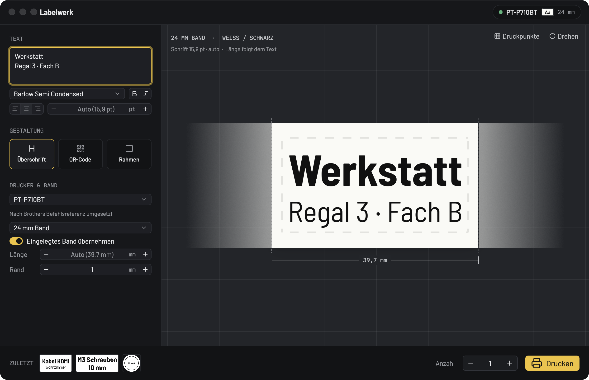

# Labelwerk

Etiketten drucken auf Brother-Labeldruckern (QL- und PT-Serie), ohne P-touch Editor. Rust, Oberfläche mit
GPUI (gpui-kit 0.7), damit später auch Windows geht.

**Status: 0.1.0-alpha.1.** Läuft auf macOS (Apple Silicon und Intel, ab macOS 13). Oberfläche auf Deutsch.
Seite: <https://mneuhaus.github.io/labelwerk/>



- Text eintippen, die Vorschau zeigt das Etikett in echter Größe und mit genau dem Layout, das gedruckt wird.
  Ein Klick auf „Druckpunkte" zeigt die Punkte, die der Drucker wirklich setzt.
- Schrift: mitgelieferte Barlow oder Systemschriften, fett/kursiv, Ausrichtung, Größe automatisch („so groß wie
  passt") oder fest in pt; erste Zeile als Überschrift
- Endlosband: Länge passt sich dem Inhalt an oder fest in mm; Text längs oder quer (⌘R)
- Extras: QR-Code (Etikettentext oder eigener Inhalt), Rahmen, Rand
- Drucker wird per USB erkannt (Modell, eingelegtes Band/Etikett samt Bandfarbe, Fehler wie „Deckel offen"), die
  App stellt sich automatisch darauf ein
- „Zuletzt gedruckt" zum schnellen Nachdrucken, Zustand bleibt beim Neustart erhalten
- ⌘P druckt

## Installieren

Unter [Releases](https://github.com/mneuhaus/labelwerk/releases) liegen `Labelwerk-<version>-macos.zip` (App) und
`labelwerk-cli-<version>-macos.tar.gz` (Kommandozeile). App entpacken und nach „Programme" ziehen.

Die App ist nicht von Apple notarisiert. Beim ersten Start meldet macOS deshalb, dass sie nicht geöffnet werden
kann: unter Systemeinstellungen → Datenschutz & Sicherheit auf „Dennoch öffnen" klicken, oder einmalig

```sh
xattr -dr com.apple.quarantine /Applications/Labelwerk.app
```

Der Drucker hängt per USB am Mac. Ein Brother-Treiber ist nicht nötig.

## Selbst bauen

```sh
./tools/bundle-macos.sh                # dist/Labelwerk.app und dist/labelwerk (CLI) für diesen Mac
./tools/bundle-macos.sh --universal    # Apple Silicon + Intel, dazu die Release-Archive in dist/
open dist/Labelwerk.app
```

Entwicklung: `cargo run -p labelwerk-app` (App) bzw. `cargo run -p labelwerk-cli -- --help`.
Umgebung: `LABELWERK_STATE=<datei>` (eigener Zustand für Tests), `LABELWERK_THEME=light|dark`,
`LABELWERK_CANVAS=graphit|hell|matte` (Arbeitsfläche), `LABELWERK_DEBUG=1` (USB-Verkehr auf stderr).
Das App-Icon entsteht mit `swift tools/make-icon.swift`.

## CLI

```sh
labelwerk status                         # angeschlossener Drucker, eingelegtes Medium
labelwerk models                         # alle bekannten Modelle mit Unterstützungsgrad
labelwerk media --model PT-P710BT        # Bänder/Etiketten eines Modells
labelwerk render -t "Kabel\nHDMI" --bold -o vorschau.png [--job job.bin]
labelwerk print  -t "M3 Schrauben" --copies 3
labelwerk decode job.bin --model PT-P710BT --media 24 -o job.png
```

`--json` liefert ein JSON-Objekt; Exit-Codes: 0 ok, 1 Fehler, 2 Drucker nicht bereit.

## Unterstützte Drucker

Die Modell- und Mediendaten (56 QL- und PT-Modelle, Pins, Druckbreiten, Offsets) stammen aus P-touch Editors
eigenen Modelldefinitionen (`tools/import-ptouch.py` → `crates/labelwerk-core/data/models.json`). Das
Protokoll je Modell steht in `crates/labelwerk-core/src/model.rs` und `research/protocol-table.md`.

| Stufe | Bedeutung | Modelle |
|---|---|---|
| Verified | Byte für Byte gegen Brothers Treiber geprüft | QL-1100 |
| Documented | nach Brothers Raster-Referenz für genau dieses Modell | übrige QL-Modelle (QL-500 bis QL-1115NWB), PT-P710BT (Status und Druck auf dem Gerät laufen, Sichtprüfung offen), PT-P700/P750W, PT-E500/E550W, PT-H500, PT-P900-Reihe |
| Assumed | gleiche Familie und Druckkopf wie dokumentierte Modelle | übrige PT-D/E/P-Modelle, siehe `labelwerk models` |
| Unsupported | anderes Protokoll | PT-9500PC/9600/9700PC/9800PCN/3600, PT-18R/18NR, PT-N25BT |

TD-, RJ-, TJ-, PJ-, MW- und VC-Geräte sprechen andere Protokolle und sind nicht dabei. Rückmeldungen, welches
Modell bei dir druckt (oder nicht), helfen sehr: bitte als Issue mit der Ausgabe von `labelwerk status --json`.

## Aufbau

```
crates/labelwerk-core   Modelle/Medien, Raster-Protokoll (PackBits, Status), Renderer, USB/CUPS-Transport
crates/labelwerk-cli    labelwerk (CLI)
crates/labelwerk-app    Labelwerk (GPUI-App)
tools/                  import-ptouch.py, bundle-macos.sh, make-icon.swift, winid.swift (Fenster-ID für Screenshots)
research/               Notizen; Brother-PDFs und Referenzdaten liegen lokal in research/docs (nicht im Git)
docs/                   GitHub-Page
```

Druckweg: USB direkt über `nusb` (so macht es auch P-touch Editor, mit Statusabfrage). Fallback: rohe Daten an
eine CUPS-Warteschlange (`lp -o raw`), wenn USB belegt ist.

## Prüfung

- `cargo test --workspace`
- `crates/labelwerk-core/tests/brother_filter.rs` schickt Testbilder durch Brothers macOS-Treiber
  (`rastertobrotherQL1100`) und vergleicht Befehle und jede Rasterzeile mit unserem Encoder. 22 von 25
  QL-1100-Medien sind byte-identisch; bei 23×23 mm, 60×86 mm und Ø 12 mm weicht Brothers CUPS-Treiber von
  Brothers eigener Referenz und P-touch Editor ab, dort folgt Labelwerk der Referenz. Ohne installierten Treiber
  werden diese Tests übersprungen.
- PT-P710BT: Status und Druck auf dem echten Gerät (24 mm TZe).

## Offen

- Windows: `nusb` braucht dort WinUSB; der saubere Weg ist der Spooler (RAW über den installierten Brother-Treiber)
- Netzwerkdrucker (QL-1110NWB, PT-P750W über TCP 9100) und Bluetooth
- Zweifarbdruck (QL-8xx), 600/360-dpi-Hochauflösung, Halbschnitt, Kettendruck
- Bilder/Logos und Barcodes außer QR
- Notarisierte App (Apple Developer ID)

## Lizenz

MIT, siehe [LICENSE](LICENSE). Die mitgelieferten Schriften Barlow und IBM Plex Mono stehen unter der SIL Open
Font License (Texte neben den Schriftdateien). Labelwerk ist kein Produkt von Brother; Brother, P-touch und die
Modellnamen sind Marken der Brother Industries, Ltd.
